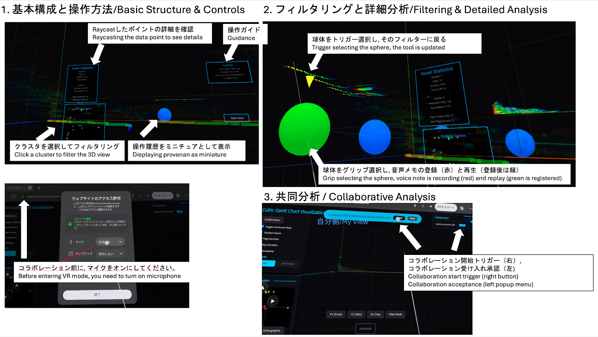
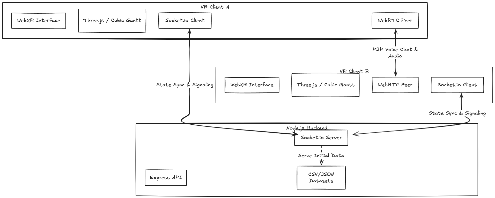

# VR Collaborative Data Visualization Platform

 <!-- Place your GIF link here -->

> **Note**: This repository serves as a portfolio showcase. The source code is currently closed-source. However, you can experience the live system or view the demo below.

🔗 **[Live Demo (Lab Server)](https://contsrv.i.kyushu-u.ac.jp/api/visualization)**  

---

## 📖 Motivation
As large-scale multidimensional datasets become increasingly complex, traditional 2D monitors often limit intuitive understanding. To solve this, I developed a **Multi-User VR Data Visualization Platform** that immerses users inside the data. It allows multiple researchers/analysts to step into the same virtual space, manipulate data, and communicate in real-time.

## ✨ Features

1. **Immersive 3D Visualization**
   - Renders multidimensional data using Cubic Gantt Chart (3D version of Gantt Chart).
2. **Real-Time Collaboration**
   - Multi-user synchronization within the same VR environment.
   - Synchronizes user pointers, head movements, and data manipulation states (filtering, selecting).
3. **P2P Voice Chat & Spatial Audio Memos**
   - Low-latency voice communication between users via WebRTC.
   - Users can record asynchronous "Voice Notes" and attach them to specific data nodes in 3D space, which other users can play back using Three.js spatial audio (`PositionalAudio`).

## 💻 Tech Stack

- **Frontend**: TypeScript, Three.js, WebXR API, three-mesh-ui, Webpack
- **Backend**: Node.js, Express
- **Networking**: Socket.io (State Synchronization), WebRTC (P2P Media Streaming)

## 🏗 Architecture & Core Mechanisms

- **Signaling**: A Node.js socket server acts as the signaling channel to establish WebRTC connections (Offer/Answer/ICE candidates).
- **State Sync**: Real-time user interactions and avatar positions are broadcasted efficiently via WebSocket.
- **Media Stream**: Voice chat is handled entirely P2P via WebRTC, ensuring high audio quality and zero server bandwidth overhead for media.

## 🧑‍💻 My Contributions

In this project, I took the lead on the core system architecture and implementation, specifically focusing on:

- **Synchronization Architecture**: Designed and implemented the core `socket-server.ts` logic to handle high-frequency VR state syncing without lagging the main render loop.
- **WebRTC Voice Integration**: Handled complex browser media constraints (HTTPS contexts, microphone streams) to build a robust P2P voice chat system from scratch.
- **Asynchronous Voice Memos**: Integrated the `MediaRecorder` API with WebXR to allow users to record audio blobs, attach them to specific 3D meshes, and play them back spatially.
- **Environment & Deployment**: Set up the build pipeline (Webpack/TypeScript) and handled cross-environment deployments (local macOS to Windows Server).

## 📝 Publications

- **[In Preparation]**  (To be submitted to 2026)
- **[Published]**Nakamura, Shohei, Kosuke Kaneko, Yoshihiro Okada, Chengjiu Yin, and Hiroaki Ogata. "Cubic gantt chart as visualization tool for learning activity data." In International Conference on Computers in Education. 2015.
- **[Published]** Nakamura, Shohei, Kosuke Kaneko, Yoshihiro Okada, Chengjiu Yin, and Hiroaki Ogata. "Cubic gantt chart as visualization tool for learning activity data." In International Conference on Computers in Education. 2015.
